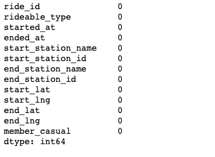
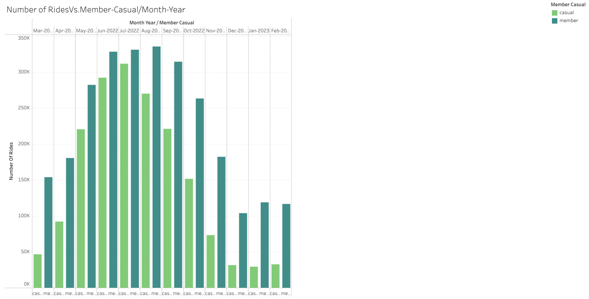
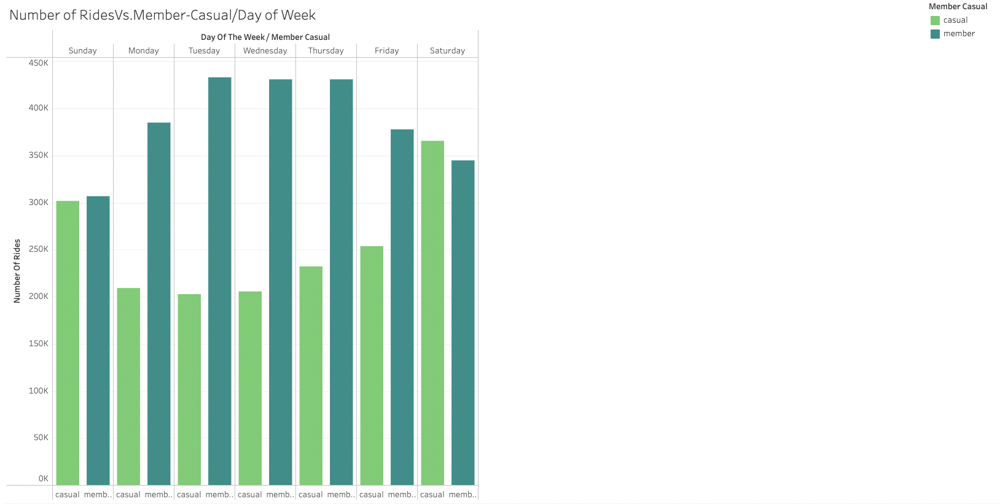

# Google-Data-Analytics-Capstone-Project

## How Does a Bike-Share Navigate Speedy Success?

This data analysis is an capstone project for the Google Data Analytics Professional Certificate.

# STEP 1: ASK

## Background 
In 2016, Cyclistic launched a successful bike-share offering. Since then, the program has grown to a fleet of 5,824 bicycles that
are geotracked and locked into a network of 692 stations across Chicago. The bikes can be unlocked from one station and
returned to any other station in the system anytime.

Until now, Cyclistic’s marketing strategy relied on building general awareness and appealing to broad consumer segments.
One approach that helped make these things possible was the flexibility of its pricing plans: single-ride passes, full-day passes,
and annual memberships. Customers who purchase single-ride or full-day passes are referred to as casual riders. Customers
who purchase annual memberships are Cyclistic members.

Cyclistic’s finance analysts have concluded that annual members are much more profitable than casual riders. Although the
pricing flexibility helps Cyclistic attract more customers, Moreno believes that maximizing the number of annual members will
be key to future growth. Rather than creating a marketing campaign that targets all-new customers, Moreno believes there is a
very good chance to convert casual riders into members. She notes that casual riders are already aware of the Cyclistic
program and have chosen Cyclistic for their mobility needs.

Moreno has set a clear goal: Design marketing strategies aimed at converting casual riders into annual members. In order to
do that, however, the marketing analyst team needs to better understand how annual members and casual riders differ, why
casual riders would buy a membership, and how digital media could affect their marketing tactics. Moreno and her team are
interested in analyzing the Cyclistic historical bike trip data to identify trends.

### Business Task
1. How do annual members and casual riders use Cyclistic bikes differently?
2. Why would casual riders buy Cyclistic annual memberships?
3. How can Cyclistic use digital media to influence casual riders to become members?

### Deliverables
1. A clear statement of the business task
2. A description of all data sources used
3. Documentation of any cleaning or manipulation of data
4. A summary of your analysis
5. Supporting visualizations and key findings
6. Your top three recommendations based on your analysis


# STEP 2: PREPARE

## Data Set
The data has been made available by Motivate International Inc. under this [license](https://ride.divvybikes.com/data-license-agreement). This is public data that you can use to explore how different customer types are
using Cyclistic bikes. But note that data-privacy issues prohibit you from using riders’ personally identifiable information. This
means that you won’t be able to connect pass purchases to credit card numbers to determine if casual riders live in the
Cyclistic service area or if they have purchased multiple single passes.

In this analysis last 6 months data were used starting from October 2022 to April 2023. Each dataset captures the details of every ride logged by 
the customers of Cyclistic. This data that has been made publicly available has been scrubbed to omit rider's personal information.

I have choosen python programming language to process the data.

# STEP 3: PROCESS

## Prepare the environment
```
# Load libraries
import pandas as pd
```

## Importing data set
```
# Importing Datasets
ridedata_202204 = pd.read_csv('./202204-divvy-tripdata.csv')
ridedata_202205 = pd.read_csv('./202205-divvy-tripdata.csv')
ridedata_202206 = pd.read_csv('./202206-divvy-tripdata.csv')
ridedata_202207 = pd.read_csv('./202207-divvy-tripdata.csv')
ridedata_202208 = pd.read_csv('./202208-divvy-tripdata.csv')
ridedata_202209 = pd.read_csv('./202209-divvy-publictripdata.csv')
ridedata_202210 = pd.read_csv('./202210-divvy-tripdata.csv')
ridedata_202211 = pd.read_csv('./202211-divvy-tripdata.csv')
ridedata_202212 = pd.read_csv('./202212-divvy-tripdata.csv')
ridedata_202301 = pd.read_csv('./202301-divvy-tripdata.csv')
ridedata_202302 = pd.read_csv('./202302-divvy-tripdata.csv')
ridedata_202303 = pd.read_csv('./202303-divvy-tripdata.csv')
```

```
# Combining all the datasets into one single dataframe
all_ridedata = [ridedata_202204,ridedata_202205,ridedata_202206,ridedata_202207,ridedata_202208,ridedata_202209,ridedata_202210,ridedata_202211,ridedata_202212,ridedata_202301,ridedata_202302,ridedata_202303]
rides = pd.concat(all_ridedata)
```

```
print(rides.info())
```


```
# find missing data points per column
missing_values_count = rides.isnull().sum()
print(missing_values_count)
```


```
rides = rides.dropna()
rides.isnull().sum()
```


```
# Information about the data frame
rides.info()
```


```
# Change data type to datetime 
rides['started_at'] = pd.to_datetime(rides['started_at'])
rides['ended_at'] = pd.to_datetime(rides['ended_at'])
```

```
# Romove unnecessary column 
rides.drop(['start_lat', 'start_lng','end_lat','end_lng'], axis=1)
```


```
# Insert useful columns 

#Time of trip started
rides['time'] = rides['started_at'].dt.strftime('%H:%M')

#Day of the week of trip started
rides['day_of_the_week'] = rides['started_at'].dt.day_name()

#Month of the trip started
rides['month'] = rides['started_at'].dt.month_name()

#Year of the trip started
rides['year'] = rides['started_at'].dt.year

#Combining 'month' & 'year' column
rides['month_year'] = pd.to_datetime(rides['month'].astype(str)+rides['year'].astype(str),format='%B%Y').dt.strftime('%b-%Y')

#Trip duration in min
rides['trip_duration_in_min'] = (rides['ended_at'] - rides['started_at']).dt.total_seconds().div(60).astype(float)

```


```
# Check invalid trip duration 
print(len(rides[rides['trip_duration_in_min']<0]))
```

```
# Remove rows of invalid trip duration
indices = rides[rides['trip_duration_in_min']<0].index
rides = rides.drop(indices)
```

# STEP 4: ANALYZE

```
rides.describe()
```


```
# Export data into a csv file 
rides.to_csv('bike_share_rides.csv',index=False,header=True)
```

# STEP 5: SHARE


From the above graph, it will show the total number of casual and member riders in the last year.



From graph above, casual riders are busy on Saturday followed by Sunday. In the week days member riders are busier than casual riders. 


The graph shows that in the summer time (May - September) number of riders is the most busy of the year. There might be an external factor like weather
and holidays impact the riders needs. It clearly shows that member riders are always higher than the casual riders across all months of the year. 


The above graph shows that classic bikes are mainly used by riders. Docked bikes are only used by casual riders and comparatively very less than classic or electric bikes.  


From the graph above we can see that in the business hours both riders ride in most amount and member riders are at the peek bettween 4pm to 6pm. 


# STEP 5: ACT
Casual riders made 38% of total trips contributing to 62% of total trip duration between March 2022 - February 2023. 

Casual customers use bikeshare services more during weekends, while members use them consistently over the entire week.


### Recommendations
Since there are less casual users riding in weekdays, provide promotions for casual riders on weekdays so that casual riders will use the bikes.

As there are more casual riders in weekends than weekdays, Provide weekend memberships will increse the amount of member riders.


#### Additional information to expand the scope of analysis
Age and gender data could be used to study targeted riders.

Pricing detail of members and casual riders could be used to study the cost structure and will lead to marketing strategy.


